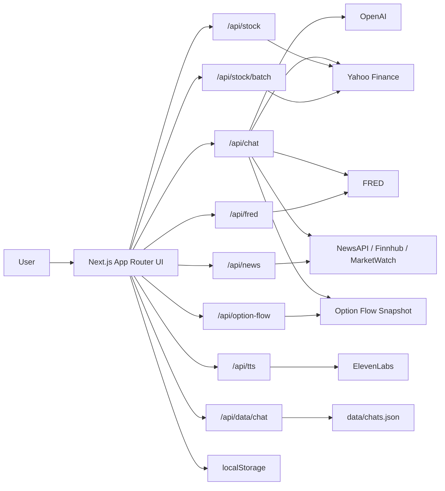
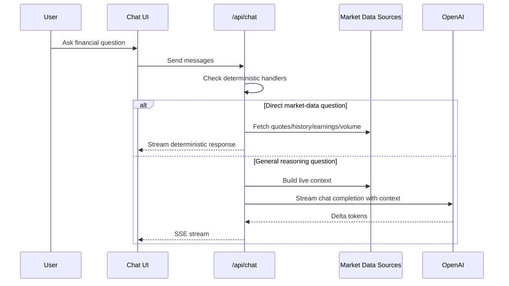

# FinPilotAI

[](https://nextjs.org/)
[](https://react.dev/)
[](https://www.typescriptlang.org/)
[](https://platform.openai.com/)
[](https://www.npmjs.com/package/yahoo-finance2)
[](https://fred.stlouisfed.org/)
[](#)

FinPilotAI is a multi-page financial intelligence app built with Next.js, React, OpenAI, Yahoo Finance, FRED, NewsAPI, Finnhub, and ElevenLabs. It combines live market data, macro dashboards, news aggregation, options-flow views, and an AI chat assistant into one product.

> [!IMPORTANT]
> FinPilotAI is not just an LLM wrapper. Several high-value chat queries are answered deterministically from market data before the model is invoked.

> [!NOTE]
> The current Option Flow page uses mocked snapshot data from `lib/option-flow.ts`, not a real-time external feed.

## Quick Navigation

- [Overview](#overview)
- [Feature Set](#feature-set)
- [Architecture](#architecture)
- [Tech Stack](#tech-stack)
- [Pages](#pages)
- [Chat System](#chat-system)
- [API Routes](#api-routes)
- [Environment Variables](#environment-variables)
- [Local Development](#local-development)
- [Deployment](#deployment)
- [Persistence](#persistence)
- [Known Limitations](#known-limitations)
- [Project Structure](#project-structure)
- [Suggested Improvements](#suggested-improvements)

## Overview

FinPilotAI is designed to do two kinds of work:

- deterministic market lookups for questions that should be answered directly from data
- model-assisted reasoning for synthesis, interpretation, and broader market explanation

That split matters. Questions like market-cap rankings, historical stock lookups, monthly volume leaderboards, and tracked earnings-calendar queries are handled directly in the backend from Yahoo Finance data instead of being guessed by the model.

## Feature Set

### Highlights

- Streaming AI financial chat with ticker detection
- Multi-tab chat sessions with persistence across refreshes
- Inline stock cards inside chat responses
- Voice dictation and ElevenLabs voice playback
- Sector graph dashboard with curated stock baskets
- News search plus trending market headlines
- Macro dashboard powered by FRED
- Weekly economic calendar with beat/miss commentary
- Theme switching and assistant behavior toggles

<details>
<summary><strong>What makes the chat assistant more than a prompt wrapper?</strong></summary>

- Direct server-side handlers for:
  - market-cap leaderboards
  - monthly volume leaderboards
  - historical stock price lookups
  - earliest-history queries
  - tracked upcoming earnings queries
  - curated sector stock suggestions
- Live macro context from FRED
- Live stock quotes and history from Yahoo Finance
- News aggregation from multiple providers
- SSE streaming output back to the browser

</details>

## Architecture



### Request Model



## Tech Stack

| Layer | Tools |
| --- | --- |
| Framework | Next.js 16 App Router |
| UI | React 19, Framer Motion, Lucide React, React Markdown |
| Charts | Recharts |
| AI | OpenAI |
| Market data | Yahoo Finance |
| Macro data | FRED |
| News | NewsAPI, Finnhub, MarketWatch RSS fallback |
| Voice | ElevenLabs |
| Persistence | `localStorage` + `data/chats.json` |

## Pages

<details open>
<summary><strong>Chat</strong></summary>

File: [app/page.tsx](/Users/danielrajakumar/code/FinPilotAi/app/page.tsx)

Capabilities:

- streaming assistant responses
- ticker detection from plain text, `$TICKER`, and company aliases
- inline mini stock cards
- voice dictation via browser speech recognition
- full-screen voice mode
- assistant playback via ElevenLabs
- multi-tab chat history

</details>

<details>
<summary><strong>Graphs</strong></summary>

File: [app/graphs/page.tsx](/Users/danielrajakumar/code/FinPilotAi/app/graphs/page.tsx)

Covers curated sector universes:

- Technology
- Consumer Goods
- Finance
- Healthcare
- Semiconductors
- Energy

Each sector has:

- representative ETF
- selected stock basket
- sector-specific news
- chart views and comparative data

</details>

<details>
<summary><strong>News</strong></summary>

File: [app/news/page.tsx](/Users/danielrajakumar/code/FinPilotAi/app/news/page.tsx)

Includes:

- ticker news search
- trending market headlines
- market mover quote strip
- normalized timestamp formatting
- fallback behavior for general market news

</details>

<details>
<summary><strong>Option Flow</strong></summary>

File: [app/options/page.tsx](/Users/danielrajakumar/code/FinPilotAi/app/options/page.tsx)

Shows:

- top bullish names
- top bearish names
- premium, confidence, trade count, and price data

> [!WARNING]
> The data source is currently a static snapshot returned from [lib/option-flow.ts](/Users/danielrajakumar/code/FinPilotAi/lib/option-flow.ts).

</details>

<details>
<summary><strong>Economy</strong></summary>

File: [app/economy/page.tsx](/Users/danielrajakumar/code/FinPilotAi/app/economy/page.tsx)

Includes:

- default FRED macro indicators
- extended “View All” macro series
- weekly economic calendar
- beat/miss inline analysis
- live macro banner

Default indicators:

- `FEDFUNDS`
- `CPIAUCSL`
- `DGS10`
- `UNRATE`
- `IPMAN`
- `PAYEMS`

</details>

<details>
<summary><strong>Settings</strong></summary>

File: [app/settings/page.tsx](/Users/danielrajakumar/code/FinPilotAi/app/settings/page.tsx)

Includes:

- light / dark theme
- persistent theme selection
- Brainrot Mode toggle

</details>

## Chat System

Main route: [app/api/chat/route.ts](/Users/danielrajakumar/code/FinPilotAi/app/api/chat/route.ts)

### Deterministic Handlers

Before hitting OpenAI, the backend checks for structured prompts such as:

- `top 5 companies by market cap right now`
- `what stocks are reporting earnings next week`
- `give a list of the top 25 highest volume traded stocks over the last month`
- `what was apple's price in 2016`
- `what is the earliest stock data you have`
- `suggest me good stocks in semiconductor sector`

These are answered directly from Yahoo Finance data.

### Model-Assisted Path

If the prompt is not caught by a deterministic route, `/api/chat` builds a live context payload and streams the request to OpenAI.

The context can include:

- FRED macro indicators
- general market news
- ticker quotes
- ticker history
- ticker news
- option-flow summary

### Ticker Detection

Ticker detection uses:

- a curated ticker allowlist
- `$AAPL` syntax
- all-caps token extraction
- alias mapping such as:
  - Apple -> `AAPL`
  - Google / Alphabet -> `GOOGL`
  - Tesla -> `TSLA`
  - Nvidia -> `NVDA`

## API Routes

| Route | Method | Purpose |
| --- | --- | --- |
| `/api/chat` | `POST` | Streaming AI chat and deterministic market-data answers |
| `/api/analyze` | `POST` | Structured news sentiment analysis for a ticker |
| `/api/news` | `GET` | News aggregation for a ticker or general market query |
| `/api/fred` | `GET` | Single or multiple FRED series |
| `/api/stock` | `GET` | Quote + history for one symbol |
| `/api/stock/batch` | `GET` | Batch quote endpoint |
| `/api/option-flow` | `GET` | Option-flow dataset |
| `/api/tts` | `POST` | ElevenLabs speech generation |
| `/api/data/chat` | `GET` / `POST` | Chat persistence |
| `/api/test-news` | `GET` | NewsAPI debug route |

<details>
<summary><strong>API route notes</strong></summary>

- `/api/chat` returns `text/event-stream`
- `/api/news` returns `{ ticker, articles }`
- `/api/stock` returns `{ quote, history }`
- `/api/data/chat` normalizes legacy single-chat payloads into session-based storage

</details>

## Data Sources

| Source | File | Used For |
| --- | --- | --- |
| Yahoo Finance | [lib/yfinance.ts](/Users/danielrajakumar/code/FinPilotAi/lib/yfinance.ts) | Quotes, history, earnings timestamps, screeners, market-cap logic |
| FRED | [lib/fred.ts](/Users/danielrajakumar/code/FinPilotAi/lib/fred.ts) | Macro indicators |
| NewsAPI | [lib/news.ts](/Users/danielrajakumar/code/FinPilotAi/lib/news.ts), [lib/finance-news.ts](/Users/danielrajakumar/code/FinPilotAi/lib/finance-news.ts) | News articles |
| Finnhub | [lib/finance-news.ts](/Users/danielrajakumar/code/FinPilotAi/lib/finance-news.ts) | Company news |
| MarketWatch RSS | [lib/finance-news.ts](/Users/danielrajakumar/code/FinPilotAi/lib/finance-news.ts) | Trending-market news fallback |
| OpenAI | [lib/openai.ts](/Users/danielrajakumar/code/FinPilotAi/lib/openai.ts) | Analysis + streaming chat |
| ElevenLabs | [app/api/tts/route.ts](/Users/danielrajakumar/code/FinPilotAi/app/api/tts/route.ts) | Voice playback |
| Local snapshot | [lib/option-flow.ts](/Users/danielrajakumar/code/FinPilotAi/lib/option-flow.ts) | Option-flow page |

## Environment Variables

> [!TIP]
> The current `.env.example` is incomplete relative to the codebase. Use the full set below.

| Variable | Required | Purpose |
| --- | --- | --- |
| `OPENAI_API_KEY` | Yes | Chat and analysis |
| `NEWS_API_KEY` | Recommended | NewsAPI lookups |
| `FINNHUB_API_KEY` | Recommended | Finnhub company news |
| `FRED_API_KEY` | Yes for Economy page | FRED series fetches |
| `ELEVEN_LABS_API_KEY` | Yes for voice features | ElevenLabs TTS |

```bash
OPENAI_API_KEY=your_openai_api_key_here
NEWS_API_KEY=your_newsapi_key_here
FINNHUB_API_KEY=your_finnhub_api_key_here
FRED_API_KEY=your_fred_api_key_here
ELEVEN_LABS_API_KEY=your_elevenlabs_api_key_here
```

## Local Development

### Setup

```bash
npm install
cp .env.example .env.local
```

Add the missing environment variables shown above, then run:

```bash
npm run dev
```

Open:

- [http://localhost:3000](http://localhost:3000)

### Available Scripts

```bash
npm run dev
npm run build
npm run start
npm run lint
```

## Deployment

This project is deployable on Vercel without a database.

### Vercel Checklist

1. Create the Vercel project
2. Add env vars:
   - `OPENAI_API_KEY`
   - `NEWS_API_KEY`
   - `FINNHUB_API_KEY`
   - `FRED_API_KEY`
   - `ELEVEN_LABS_API_KEY`
3. Redeploy after changing env vars

> [!NOTE]
> The repo includes [next.config.ts](/Users/danielrajakumar/code/FinPilotAi/next.config.ts) with `allowedDevOrigins` configured for `10.29.13.9`.

## Persistence

Chat state uses two layers:

### Browser layer

- `localStorage` key: `finpilot-chat-store`
- `localStorage` key: `brainrotMode`
- `localStorage` key: `finpilot-theme`

### Filesystem layer

- [data/chats.json](/Users/danielrajakumar/code/FinPilotAi/data/chats.json)

Session shape:

```json
{
  "sessions": [
    {
      "id": "uuid",
      "title": "Chat title",
      "messages": [],
      "createdAt": "ISO timestamp",
      "updatedAt": "ISO timestamp"
    }
  ],
  "activeSessionId": "uuid"
}
```

## What Is Live vs. What Is Static

### Live / runtime-fetched

- stock quotes
- stock history
- batch quotes
- earnings timestamps
- most-active screener results
- FRED macro data
- NewsAPI articles
- Finnhub company news
- MarketWatch RSS fallback
- OpenAI responses
- ElevenLabs audio

### Static / mocked / curated

- option-flow leaderboard data in [lib/option-flow.ts](/Users/danielrajakumar/code/FinPilotAi/lib/option-flow.ts)
- economic calendar schedule and historical entries in [lib/econ-calendar.ts](/Users/danielrajakumar/code/FinPilotAi/lib/econ-calendar.ts)
- sector universes in `app/graphs/page.tsx` and `app/api/chat/route.ts`
- candidate universes for some leaderboard handlers

## Known Limitations

> [!WARNING]
> This project is strong as a product prototype, but some parts are still intentionally simple.

<details open>
<summary><strong>Current constraints</strong></summary>

- Option Flow is not a real live provider integration yet
- Sector universes are curated, not exhaustive
- Some leaderboard handlers rank from a practical candidate universe, not a full-market census
- Voice dictation depends on browser speech-recognition support
- `data/chats.json` is not a multi-user persistence design
- News quality degrades when news keys are missing

</details>

## Project Structure

```text
FinPilotAi/
├── app/
│   ├── api/
│   │   ├── analyze/
│   │   ├── chat/
│   │   ├── data/chat/
│   │   ├── fred/
│   │   ├── news/
│   │   ├── option-flow/
│   │   ├── stock/
│   │   ├── stock/batch/
│   │   ├── test-news/
│   │   └── tts/
│   ├── economy/
│   ├── graphs/
│   ├── news/
│   ├── options/
│   ├── settings/
│   ├── globals.css
│   ├── layout.tsx
│   └── page.tsx
├── components/
├── data/
│   └── chats.json
├── lib/
├── types/
├── .env.example
├── next.config.ts
├── package.json
└── README.md
```

## Important Files

| Area | File |
| --- | --- |
| Main chat UI | [app/page.tsx](/Users/danielrajakumar/code/FinPilotAi/app/page.tsx) |
| Chat orchestration | [app/api/chat/route.ts](/Users/danielrajakumar/code/FinPilotAi/app/api/chat/route.ts) |
| Chat persistence | [app/api/data/chat/route.ts](/Users/danielrajakumar/code/FinPilotAi/app/api/data/chat/route.ts) |
| Market data layer | [lib/yfinance.ts](/Users/danielrajakumar/code/FinPilotAi/lib/yfinance.ts) |
| Macro data layer | [lib/fred.ts](/Users/danielrajakumar/code/FinPilotAi/lib/fred.ts) |
| News aggregation | [lib/finance-news.ts](/Users/danielrajakumar/code/FinPilotAi/lib/finance-news.ts) |
| OpenAI integration | [lib/openai.ts](/Users/danielrajakumar/code/FinPilotAi/lib/openai.ts) |
| Sidebar shell | [components/AppSidebar.tsx](/Users/danielrajakumar/code/FinPilotAi/components/AppSidebar.tsx) |
| Theme provider | [components/ThemeProvider.tsx](/Users/danielrajakumar/code/FinPilotAi/components/ThemeProvider.tsx) |

## Suggested Improvements

- Replace mocked option-flow data with a real provider
- Update `.env.example` so it matches the actual codebase
- Move file-based chat persistence to a per-user database
- Centralize duplicated sector definitions
- Add tests for deterministic chat handlers
- Add monitoring for upstream API failures
- Break large page files into smaller components

## Status

FinPilotAI is already usable as a financial dashboard and AI market copilot. Its strongest traits are:

- live market and macro data integration
- deterministic handling for several important chat prompts
- coherent multi-page product design
- practical local deployability

Its biggest architectural weaknesses are:

- file-based persistence
- mocked option-flow data
- duplicated domain configuration
- minimal formal test coverage

Even with those limitations, the project is materially more capable than a plain chatbot because it combines UI, live APIs, deterministic data logic, and LLM reasoning in a single workflow.
